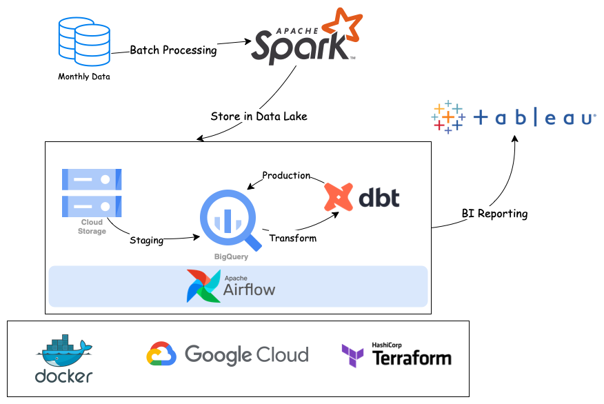

# BigQuery-ELT

## Introduction

This is a docker-containerized ELT data pipeline to extract and load data in monthly batches into BigQuery Data Warehouse, where it is transformed and prepared for BI reporting.

## Dataset

The dataset comes from monthly [TLC Trip Record Data](https://www.nyc.gov/site/tlc/about/tlc-trip-record-data.page) for NYC Green and Yellow taxi trips spanning from 2019 - 2021. It consists of over 200 million records.

## Tools & Technologies

- Cloud - [**Google Cloud Platform**](https://cloud.google.com)
- Infrastructure as Code - [**Terraform**](https://www.terraform.io)
- Containerization - [**Docker**](https://www.docker.com), [**Docker Compose**](https://docs.docker.com/compose/)
- Batch Processing - [**Apache Spark**](https://spark.apache.org)
- Transformation - [**dbt**](https://www.getdbt.com)
- Orchestration - [**Airflow**](https://airflow.apache.org)
- Data Lake - [**Google Cloud Storage**](https://cloud.google.com/storage)
- Data Warehouse - [**BigQuery**](https://cloud.google.com/bigquery)
- Data Visualization - [**Tableau Desktop**](https://www.tableau.com/products/desktop)
- Language - [**Python**](https://www.python.org)

## Architecture



## Final Result

The dashboard is now live and can be accessed on [Tableau Public](https://public.tableau.com/views/NYCTaxiDashboard_16740928210530/Dashboard?:language=en-US&:display_count=n&:origin=viz_share_link). The SQL queries for cleaning and transformation steps are present in `BigQuery-ELT/dbt/models`

## Setup

**WARNING**: You will be charged for all the infrastructure setup. You can avail 300$ in credit by creating a new account on Google Cloud Platform (GCP).

### Pre-requisites

- Google Cloud Platform Account
    - You have a GCP project with the project ID `<your-gcp-project-id>`
    - You have environment variable `GOOGLE_APPLICATION_CREDENTIALS` set, which points to your Google Service Account JSON file. The service account should have **Storage Admin**, **Storage Object Admin**, and **BigQuery Admin** permissions.
    - `gcloud` sdk installed. To authenticate, run
        ```
        gcloud auth activate-service-account --key-file $GOOGLE_APPLICATION_CREDENTIALS

        ```
- Terraform
- Docker, Docker Compose

### Terraform

The following steps will help you spin up the required infrastructure, which includes one GCS bucket and two BigQuery datasets

#### Move into terraform folder
```
cd BigQuery-ELT/terraform

```

#### Initiate terraform and download the required dependencies
```
terraform init

```

#### View the Terraform plan

You will be asked to enter two values. For the GCP Project ID, enter `<your-gcp-project-id>`. For the GCS bucket, enter any name that is unqiue across GCS. A good idea is to concatenate desired name with your GCS Project ID to make it unique. We will refer to the entered bucket name as `<your-gcs-bucket-name>`.

```
terraform plan

```

Terraform plan should show the plan for creating following services:

1. `google_storage_bucket.bucket` - This is the data lake bucket, used to store raw parquet files in monthly batches
2. `google_bigquery_dataset.stg_dataset` - This is the `staging` dataset for raw data
3. `google_bigquery_dataset.prod_dataset` - This is the `prod` dataset for BI reporting

#### Apply the infrastructure
```
terraform apply

```

You should now see the above bucket and datasets in your GCS project.

Once done, set the environment variables `GCP_PROJECT_ID`, `GCP_GCS_BUCKET` to `<your-gcp-project-id>`, `<your-gcs-bucket-name>` respectively.

### Get Going with Airflow

#### Move into Airflow directory
```
cd BigQuery-ELT/airflow

```

#### Set Airflow user
```
echo -e "AIRFLOW_UID=$(id -u)" > .env

```

#### Run the container
```
docker compose up

```

At this point, the Airflow Webserver UI should be available on `localhost:8080`. Don't forget to port-forward `8080` in case running on a VM. You can login with `user:airflow` and `password:airflow` and trigger the `pipeline` DAG.


#### Stop and remove containers
```
docker compose down

```

#### Destroy Infrastructure
```
cd ../terraform/ && terraform destroy

```

## Future work

- Add more data quality tests in dbt
- Include CI/CD